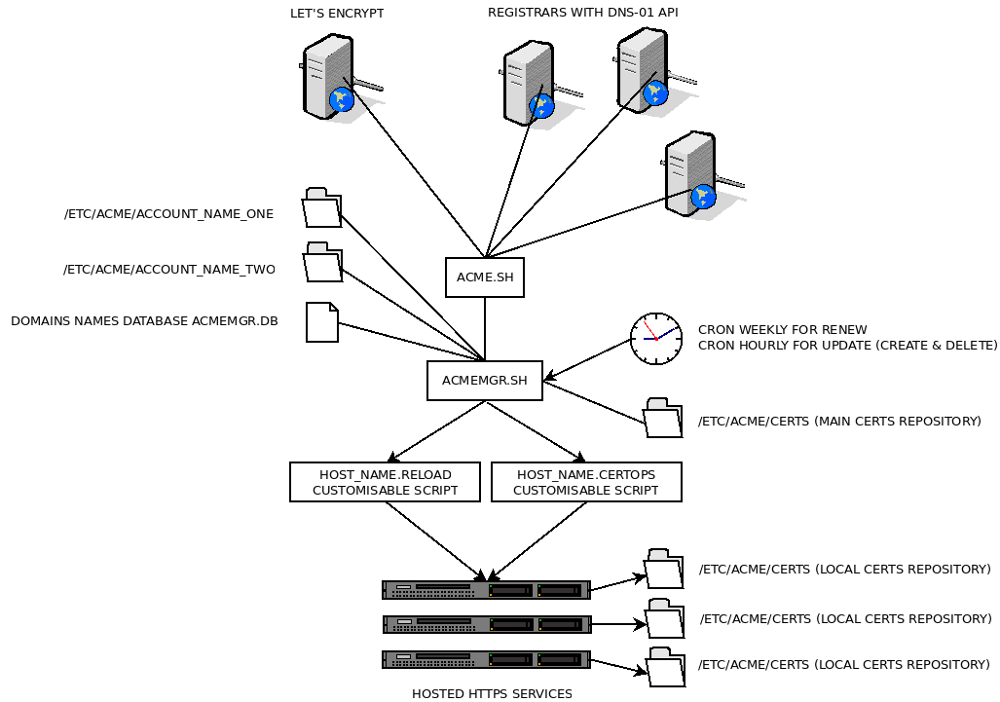

Quick link table

<!-- MarkdownTOC -->

- [ACMEMGR.SH](#acmemgrsh)
  - [Introduction](#introduction)
  - [Purpose](#purpose)
  - [Features](#features)
  - [Architecture \(big view\)](#architecture-big-view)
  - [Architecture \(modular view\)](#architecture-modular-view)
  - [Requirements](#requirements)
  - [Download](#download)
  - [Install](#install)
    - [Base install, for one or many DNS-01 accounts.](#base-install-for-one-or-many-dns-01-accounts)
    - [Populating the domains names database](#populating-the-domains-names-database)
  - [Setting up one DNS-01 account](#setting-up-one-dns-01-account)
    - [Create account structure](#create-account-structure)
    - [Filling the account keys and secret](#filling-the-account-keys-and-secret)
    - [Rotate log](#rotate-log)
  - [Setting up one host](#setting-up-one-host)
    - [HOST_NAME.certops](#host_namecertops)
    - [HOST_NAME.reload](#host_namereload)
  - [Basic use](#basic-use)
    - [Command line](#command-line)
    - [Return codes](#return-codes)
    - [Using --create](#using---create)
    - [Using --renew](#using---renew)
    - [Using --update](#using---update)
    - [Using --copy](#using---copy)
    - [Using --delete](#using---delete)
    - [Using --status](#using---status)
    - [Using --verbose](#using---verbose)
  - [High level use](#high-level-use)
    - [Batch mode](#batch-mode)
    - [Create a certificate](#create-a-certificate)
    - [Delete a certificate](#delete-a-certificate)
  - [Real world workflow](#real-world-workflow)
    - [Good practises](#good-practises)
  - [Multi-accounts tree example](#multi-accounts-tree-example)
  - [Build Instructions](#build-instructions)
    - [Software](#software)
    - [Documentation](#documentation)
  - [Releases log](#releases-log)
    - [Authors & Contributors](#authors--contributors)
  - [Miscellaneous](#miscellaneous)
    - [Localization](#localization)
    - [Known bugs](#known-bugs)
    - [Roadmap](#roadmap)
    - [Contact](#contact)
    - [Licence](#licence)
- [APPENDICES](#appendices)
  - [When something going wrong](#when-something-going-wrong)
  - [Let's Encrypt certificate files](#lets-encrypt-certificate-files)
  - [Let's Encrypt certificate .conf format](#lets-encrypt-certificate-conf-format)
  - [Nginx reloading](#nginx-reloading)
    - [Check your system](#check-your-system)
    - [Check ExecReload property](#check-execreload-property)
  - [Glossary](#glossary)
  - [Test set](#test-set)
    - [Test 01 - Run the program without arguments](#test-01---run-the-program-without-arguments)
    - [Test 02 - Check the status listing](#test-02---check-the-status-listing)
    - [Test 03 - Check the verbose listing](#test-03---check-the-verbose-listing)
    - [Test 04 - Create one new domain certificate](#test-04---create-one-new-domain-certificate)
    - [Test 05 - Delete one domain certificate](#test-05---delete-one-domain-certificate)
    - [Test 06 - Create three new domains certificates and delete three others](#test-06---create-three-new-domains-certificates-and-delete-three-others)
    - [Test 07 - Check acmemgr.updates](#test-07---check-acmemgrupdates)
    - [Test 08 - Check acmemgr.renew](#test-08---check-acmemgrrenew)

<!-- /MarkdownTOC -->


# ACMEMGR.SH

## Introduction

**`acmemgr.sh`** is an **`acme.sh`** manager for **unlimited** CERTS, TLS services, hosts and DNS-01 accounts from domains names providers.

**`acmemgr.sh`** is designed to be at the sides of [https://github.com/Neilpang/acme.sh](https://github.com/Neilpang/acme.sh), the most valuable V1 and V2 protocol compliant ACME client ever written for [https://letsencrypt.org](https://letsencrypt.org), the sole free, automated, and open certificate authority brought to you by the non-profit Internet Security Research Group (ISRG).

**`acmemgr.sh`**, as its companion and model **`acme.sh`**, is "written purely in Shell (Unix shell) language" as pointed out by **`Neilpang`** the **`acme.sh`** author himself : no dependency at all (as we can't seriously consider a shell script interpreter as a dependence in a Unix system).

**`acmemgr.sh`** manage:

- **N domains certificates** (through **`acme.sh`** and [**Let's Encrypt** service](https://letsencrypt.org/));
- on **N https services** (web or email or whatever - **childs scripts configurable**);
- on **N hosts** (dedicated or virtuals);
- with **N DNS-01 accounts** (even from **different hosting services**). 

**Let's Encrypt wildcard certificates can only be obtained through DNS-01 method as Let's Encrypt considers it's the only method that offers an appropriate security level.**

## Purpose

There are mainly two methods of certificate management with Let's Encrypt: HTTP-01 and DNS-01.

At first glance, HTTP-01 seems the simplest, but this feeling is misleading. DNS-01 is quickly emerging as the only way to go, as soon as we go beyond managing a few websites, or when using a proxy.

DNS-01 also opens other doors, such as the ability to create certificates even before the creation of the service (website, mail server, etc...).

On the other side, **`acme.sh`** is a swiss knife at its best. It knows how to do simply everything. Compatible with ACME V1 and V2 protocol, it manages not only HTTP-01 and DNS-01, but also usual web servers like Apache or Nginx, pre and post-processing scripts, certificate lists, etc ...

However, it seems that in the case of a somewhat serious and / or heterogeneous infrastructure, it would certainly be more efficient to leave **`acme.sh`** what it does best (dealing with Let's Encrypt) and delegate the higher level, that is to say, the management of certificates for your infrastructure, to another program.

This approach is compliant with the spirit of Unix systems: a single feature for a single program. This is why **`acmemgr.sh`** is proposed. 

Because we need multi-accounts DNS provider, among many other things.

Once installed, thanks to **`acmemgr.sh`**, the management of hundreds of certificates, servers and other DNS providers, in a multi-accounts environment, is simply managed by a single list, in a single file.

The creation, deletion and renewal of certificates, but also their propagation and deletion on remote servers, as well as the sending of service emails and logs: everything is managed transparently by `acmemgr.sh`!

To create a certificate: create a line in the list.

To delete a certificate, add "`DELETING`" at the end of this line.

There is noting else to do. 

All resulted actions will be reported by email.

The management of this file can even be delegated to an interactive program as part of an infrastructure management software: imagination is the limit.

## Features

### Main:

- Handle wild certificates (like `*.example.com`);
- When creating certificate which starts with "`www.`" (like "`www.example.com`"), automatically adds the domain name "example.com" in certificate;
- Certificate request for renewal is done only when the current certificate is only valid for one month; 
- The certificates operations (copy and delete) to distant hosts operations are fully customizable;
- The service linked to the certificate (web or email or whatever) is reloaded only when the certificate is successfully created, renewed or deleted (no reload for no reason);
- More, the service is restarted only once, even there are more than one  updated certificate linked to the service (one reload only for N certificates depending of the same service on the same host);
- The reload or restart of the service after certificate update is fully customizable;
- When **`acmemgr.sh`** is renamed acmemgr.renew, it behaves as if it was started with the `--renew` parameter and could be placed directly in `/etc/cron.daily|weekly`
- When **`acmemgr.sh`** is renamed acmemgr.update, it behaves as if it was started with both `--create` and `--delete` arguments and could be placed directly in `/etc/cron.hourly`
- Don't need sudo/root.

Coding style:

- Defensive programming in mind with consistent logging and mailing messages;
- Extensive checks before remotely erase certificates declared to be deleted. No use of recursive remove for safety.

## Architecture (big view) 

This a a simplified view how **`acmemgr.sh`** works.

All the management is done in a centralized CERTIFICATE DISTRIBUTION SERVER:

- Only one host to manage a pool of registrars, hosts and domains names;
- Simple, modulat and understandable architecture;
- Only one file to manage : the domain name database.


## Architecture (modular view)

This a modular view how **`acmemgr.sh`** works. 

The CERTIFICATE DISTRIBUTION SERVER host only:

- Two scripts : `acme.sh` and `acmemgr.sh`;
- One database file, `acmemgr.db`, in a comma delimited text format;
- One directory holding all certificates;
- As many subdirectories as registrars DNS-01 accounts;
- As many customizable scripts as needed to reload services and copy certificates.

For a more detailed view at the file level, see below the "[Multi-accounts tree example](#multi-accounts-tree-example)" section.



## Requirements

- Bash or compatible shell;
- A least one valid DNS-01 account;
- A host with mail sending capability;
- Valid ssh keys to update distant hosts.

## Download

[https://github.com/sowebio/acmemgr.sh](https://github.com/sowebio/acmemgr.sh)

## Install

<h3>Base install, for one or many DNS-01 accounts.</h3>

To ease the beginning of the setup, you may use a pre-install script…

```sh
sudo --login

git clone https://github.com/Sowebio/acmemgr.sh.git
cd ./acmemgr.sh
./install.sh
```

Output:
```
Clonage dans 'acme.sh'...
remote: Enumerating objects: 23, done.
remote: Counting objects: 100% (23/23), done.
remote: Compressing objects: 100% (16/16), done.
remote: Total 8926 (delta 7), reused 16 (delta 7), pack-reused 8903
Réception d'objets: 100% (8926/8926), 3.50 MiB | 3.41 MiB/s, fait.
Résolution des deltas: 100% (5188/5188), fait.
Vérification de la connectivité... fait.
Create directories...
Copy files...
Populate files...
```

…or manually following the instructions below. 

Download [`acme.sh`](https://github.com/Neilpang/acme.sh), [`acmemgr.sh`](https://github.com/Sowebio/acmemgr.sh), create some directories and create and copy some files: 

```sh
sudo --login

git clone https://github.com/Neilpang/acme.sh.git
git clone https://github.com/Sowebio/acmemgr.sh.git

mkdir /etc/acme
mkdir /var/log/acme

cp /root/acme.sh/acme.sh /usr/local/bin
cp /root/acmemgr.sh/acmemgr.sh /usr/local/bin
cp /root/acmemgr.sh/acmemgr.db /etc/acme
cp /root/acmemgr.sh/examples/*.certops /etc/acme
cp /root/acmemgr.sh/examples/*.reload /etc/acme

touch /etc/logrotate.d/acme
```

Fill `/etc/logrotate.d/acme`:

```logrotate
/var/log/acme/acmemgr.log {
  rotate 12
  monthly
  compress
  missingok
  notifempty
}
```

### Populating the domains names database

Fill `/etc/acme/acmemgr.db`:

```sh
#-------------------------------------------------------------------------------
# ACMEMGR.SH - an ACME.SH manager using DNS-01 issued LETSENCRYPT certificates
#
# acmemgr.db - domains names database
#-------------------------------------------------------------------------------
#
# HOST_NAME       : Host name for scripting, mailing and filtering purposes (only a-z,0-9,'-','_')
# HOST_LOGIN      : Host login
# HOST_FQDN       : Host url (full qualified form or "domuNNNv1" for local HOST)
# HOST_PORT       : Host port
# ACCOUNT_NAME    : Registrar DNS-01 API account to which the domain name belongs
# DOMAIN_NAME     : Domain name hosted
# [DOMAIN_STATUS] : Domain status (undefined or set to "DELETING" to suppress the certificate)
#
#-------------------------------------------------------------------------------

# NOTICE #######################################################################
# To benefit from the smart reload function, you must sort this list by HOST_NAME.
# A domain name beginning by "[www.]example.com" gets an extra "example.com" in certificate.
# NOTICE #######################################################################

declare -a DOMAINS_NAMES_LIST=(

#"HOST_NAME;HOST_LOGIN;HOST_FQDN,HOST_PORT;ACCOUNT_NAME;DOMAIN_NAME;[DOMAIN_STATUS]"


"rs11domu010;root;domu010v1;12345;ACCOUNT_NAME_ONE;www.domain1.tld"
"rs11domu010;root;domu010v1;12345;ACCOUNT_NAME_ONE;www.domain2.tld"

"rs11domu110;root;domu110v1;45678;ACCOUNT_NAME_TWO;www.domain3.tld"
"rs11domu110;root;domu110v1;45678;ACCOUNT_NAME_TWO;www.domain6.tld"
"rs11domu110;root;domu110v1;45678;ACCOUNT_NAME_TWO;www.domain4.tld"
"rs11domu110;root;domu110v1;45678;ACCOUNT_NAME_TWO;www.domain5.tld"

"rs11domu001;root;domu110v1;45678;ACCOUNT_NAME_ONE;www.domain8.tld"
"rs11domu001;root;domu110v1;45678;ACCOUNT_NAME_TWO;www.domain7.tld"

"rs11domu120;root;domu120v1;61234;ACCOUNT_NAME_ONE;www.domain9.tld"

"rs11domu210;root;domu210v1;18023;ACCOUNT_NAME_FIFTEEN;www.domainN.tld"


# DO NOT DELETE THE LINE BELOW #################################################
"null;null;null;null;null;null"
# DO NOT DELETE THE LINE ABOVE #################################################
)

#-------------------------------------------------------------------------------
# EOF
#-------------------------------------------------------------------------------
```

When creating certificate which starts with "`www.`" (like "`www.example.com`"), **`acmemgr.sh`** automatically adds the domain name "`example.com`" in certificate. This behaviour is useful to handle gracefully all uses cases : `http://example.com/`, `http://www.example.com/`, `https://example.com`, `https://www.example.com`.

If you reuse some existing certificates, tag them CREATED:

```sh
# A Domain already created

"rs11domu010;root;domu010v1;12345;ACCOUNT_NAME_ONE;www.example.com;CREATED"
```

## Setting up one DNS-01 account

The following is about the **first** account named **ACCOUNT_NAME_ONE** (repeat the process for each new account).

### Create account structure

Create DNS-01 **ACCOUNT_NAME_ONE** account directory and copy dnsapi directory:

```
root@system: mkdir /etc/acme/ACCOUNT_NAME_ONE
root@system: cp -r /root/acme/dnsapi /etc/acme/ACCOUNT_NAME_ONE
```

Create /etc/acme/**ACCOUNT_NAME_ONE**/account.conf containing:

```
ACCOUNT_CONF_PATH="/etc/acme/ACCOUNT_NAME_ONE/myaccount.conf"
```

Create `/etc/acme/`**`ACCOUNT_NAME_ONE`**`/myaccount.conf` containing:

```sh
LOG_FILE='/var/log/acme/ACCOUNT_NAME_ONE.log'
LOG_LEVEL=1

#AUTO_UPGRADE="1"
#NO_TIMESTAMP=1

EMAIL_EVEN_NOT_RENEWED=1

ACCOUNT_DNS01="dns_ovh"
    
CERT_HOME='/etc/acme/certs'
ACCOUNT_KEY_PATH='/etc/acme/ACCOUNT_NAME_ONE/myaccount.key'
USER_AGENT='acme client'
ACCOUNT_EMAIL='your@email.adress'
```

Most parameters are only used by acme.sh, except for three:

- `ACCOUNT_DNS01` will be used consistently by **`acmemgr.sh`** and `acme.sh`.
- `CERT_HOME` will be used consistently by **`acmemgr.sh`** and `acme.sh`.
- `ACCOUNT_EMAIL` will be used for two purposes: through acme.sh, Let's Encrypt will be able to sent you messages (about the near expiring certificates, for example) and **`acmemgr.sh`** will be able to sent you all events about yours certificates management.

A parameter is only used by `acmemgr.sh`:

- `EMAIL_EVEN_NOT_RENEWED` set to `1` send an email to confirm that renewing has been tested but not mandatory yet.


### Filling the account keys and secret

Assuming your **first** DNS-01 account is hosted at [**OVH**](https://ovh.com) and you obtained **`AK-KEY`**, **`AS-SECRET`** and **`CK-KEY`** from your OVH personal web page account.

Update the beginning of `/etc/acme/`**`ACCOUNT_NAME_ONE`**`/dnsapi/`**`dns_ovh.sh`**.

```sh
# Application Key
OVH_AK="AK-KEY"
# Application Secret
OVH_AS="AS-SECRET"
# Consumer Key
OVH_CK="CK-KEY"
…/…
# End-point
OVH_END_POINT=ovh-eu -- Choose the best location for you
…/…
```

### Rotate log

Update `/etc.logrotate.d/acme`:

```
/var/log/acme/ACCOUNT_NAME_ONE.log {
  rotate 12
  monthly
  compress
  missingok
  notifempty
}

/var/log/acme/acmemgr.log {
  rotate 12
  monthly
  compress
  missingok
  notifempty
}
```
**Repeat this section for each new DNS-01 account.**

## Setting up one host

`acmemgr.sh` is designed to be used in a non limited VM numbers, which each VM hosting only one service type. 

Mixed hosting of services like web and email servers is not recommended, as certificates pathes and ways of service reload will be certainly differents.

So we can defined two customizable scripts to:

- Certificates files operations (currently copy and delete), named `HOST_NAME.certops`;
- Reload the certificates dependent service, named `HOST_NAME.reload`.

`HOST_NAME` is the field `HOST_NAME` defined in `acmemgr.db`

### `HOST_NAME.certops`

```sh
#!/usr/bin/env bash
#----------------------------------------------------------------------------
# ACMEMGR.SH : an ACME.SH manager using DNS-01 issued LETSENCRYPT certificates
#
# HOST_NAME.certops - Distant certificates files operations for common uses (Nginx, etc...)
#----------------------------------------------------------------------------

if [ "${DOMAIN_STATUS:0:7}" == "${DOMAIN_STATUS_DELETING:0:7}" ]; then

  # Safe delete without using recursive remove. In ${CERT_DIR}, delete 7 files {HOST_FQDN}.cer/.conf/.csr/.csr.conf/.key,ca.cer,fullchain.cer, then remove ${CERT_DIR}

  ssh -p ${HOST_PORT} ${HOST_LOGIN}@${HOST_FQDN} "rm --force ${CERT_DIR}/${DOMAIN_NAME}.cer ${CERT_DIR}/${DOMAIN_NAME}.conf ${CERT_DIR}/${DOMAIN_NAME}.csr ${CERT_DIR}/${DOMAIN_NAME}.csr.conf ${CERT_DIR}/${DOMAIN_NAME}.key ${CERT_DIR}/${CERT_CA} ${CERT_DIR}/${CERT_FULLCHAIN} ; rmdir ${CERT_DIR}"

  # Directory check : return 0 if ${CERT_DIR} does not exist, 1 if if ${CERT_DIR} exist

  ssh -p ${HOST_PORT} ${HOST_LOGIN}@${HOST_FQDN} "[ ! -d ${CERT_DIR} ]"

else

  # Create domain name directory ${CERT_DIR} in {HOST_FQDN}:${CERT_DIR}

  ssh -p ${HOST_PORT} ${HOST_LOGIN}@${HOST_FQDN} "mkdir -p ${CERT_DIR}"

  # Copy certificates files ${DOMAIN_KEY} and ${DOMAIN_CERT} to {HOST_FQDN}:${CERT_DIR}/

  scp -P ${HOST_PORT} ${DOMAIN_KEY} ${DOMAIN_CERT} ${HOST_LOGIN}@${HOST_FQDN}:${CERT_DIR}/

fi

#----------------------------------------------------------------------------
# EOF
#----------------------------------------------------------------------------
```

### `HOST_NAME.reload`

```sh
#!/usr/bin/env bash
#----------------------------------------------------------------------------
# ACMEMGR.SH : an ACME.SH manager using DNS-01 issued LETSENCRYPT certificates
#
# nginx.reload - Nginx smart reload (see documentation)
#----------------------------------------------------------------------------

systemctl reload nginx

#----------------------------------------------------------------------------
# EOF
#----------------------------------------------------------------------------
```

**Repeat this section for each new host.**

## Basic use

### Command line

Commands (one at a time):

<dl>
	<dt><code>--create</code></dt><dd>Create non-existent certificate (according to acmemgr.db database)</dd>
	<dt><code>--renew</code></dt><dd>Renew certificates (from a month before they expire)</dd>
	<dt><code>--update</code></dt><dd>Update certificates (create and delete according to acmemgr.db database)</dd>
	<dt><code>--copy</code></dt><dd>Distribute certificates on hosts (dedicated or virtuals)</dd>
	<dt><code>--delete</code></dt></dd>Delete certificates (according to acmemgr.db database)</dd>
	<dt><code>--status</code></dt></dd>Status of certificates (with validity dates)"</dd>
	<dt><code>--verbose</code></dt></dd>Status of certificates (with last operation dates and validity dates)"</dd>
	<dt><code>--help</code></dt></dd>Command line help</dd>
</dl>

### Return codes

- `0` - No fatal error, read acmemgr.log for process related errors
- `1` - Command error
- `2` - Domains names datase `acmemgr.db` not found.
- `3` - File `/etc/acme/ACCOUNT_NAME/myaccount.conf` not found.
- `4` - File `/etc/acme/HOST_NAME.certops` not found.
- `5` - File `/etc/acme/HOST_NAME.reload` not found.

### Using `--create`

Create untagged Certificates in `acmemgr.db`.

Check if the certificate does not exist.

Create certificate, through Let's Encrypt.

Copy to distant host the certificates present in acmemgr.db and nonexistent in the certificates directory.

Tag domain(s) name(s) in a`cmemgr.db` as "`CREATED` - with date and time".

Log and send mail (info or error).

### Using `--renew`

Renew Certificates tagged "`CREATED`" or "`RENEWED`" in `acmemgr.db`.

Check if the certificate already exists.

Renew certificates, through Let's Encrypt, only when they are two months old.

Tag domain(s) name(s) in acmemgr.db as "`RENEWED` - with date and time".

Log and send mail (info or error).

### Using `--update`

Create and delete certificates in one pass.

See [`--create`](#using---create) and [`--delete`](#using---delete) paragraphs for further information.

### Using `--copy`

Check if the certificate already exists.

Copy certificates files to distant hosts.

Log and send mail (info or error).

### Using `--delete`

Delete Certificates tagged "`DELETING`" in `acmemgr.db`.

Check if the certificate already exists.

Revoke certificate through Let's Encrypt.

Delete certificates files on remote host.

Tag domain(s) name(s) in `acmemgr.db` as "`DELETED` - with date and time".

Log and send mail (info or error).

### Using `--status`

Check certificates status and validity dates.

```
Sowebio SARL (R) An acme.sh manager using DNS-01 protocol. Version 0.6
Copyright    (C) Stephane Riviere 2017-2018, according to GPLv3 or greater.

Certificate: w978.example.com             CREATION (in progress)
Certificate: w979.example.com             CREATED                 notBefore=Feb 12 13:42:13 2018 GMT notAfter=May 13 13:42:13 2018 GMT 
Certificate: w980.example.com             CREATED                 notBefore=Feb 12 13:25:25 2018 GMT notAfter=May 13 13:25:25 2018 GMT 
Certificate: w980.example.com             DELETED 
Certificate: w981.example.com             DELETED 
```

### Using `--verbose`

Check certificates status, last operation dates and validity dates.

```
Sowebio SARL (R) An acme.sh manager using DNS-01 protocol. Version 0.6
Copyright    (C) Stephane Riviere 2017-2018, according to GPLv3 or greater.

Certificate: w978.example.com             CREATED - lundi 12 février 2018, 17:08:44 (UTC+0100)            notBefore=Feb 12 15:08:33 2018 GMT notAfter=May 13 15:08:33 2018 GMT 
Certificate: w979.example.com             CREATED - lundi 12 février 2018, 15:25:36 (UTC+0100)            notBefore=Feb 12 13:42:13 2018 GMT notAfter=May 13 13:42:13 2018 GMT 
Certificate: w980.example.com             CREATED - lundi 12 février 2018, 15:25:36 (UTC+0100)            notBefore=Feb 12 13:25:25 2018 GMT notAfter=May 13 13:25:25 2018 GMT 
Certificate: w980.example.com             DELETED - lundi 12 février 2018, 15:58:39 (UTC+0100)
Certificate: w981.example.com             DELETED - lundi 12 février 2018, 15:59:56 (UTC+0100)
```

## High level use

Once installed and set, this is the way to use **`acmemgr.sh`** on a day by day basis.

### Batch mode

When **`acmemgr.sh`** is renamed `acmemgr.renew` and placed in `/etc/cron.weekly`: 

- Checking every week certificates renewing.

When **`acmemgr.sh`** is renamed `acmemgr.update` and placed in `/etc/cron.hourly`: 

- Updating certificates pool every hour by creating and deleting them according to the file `acmemgr.db`

### Create a certificate

Create a new line in `acmemgr.db`:

```sh
"rs11domu120;root;domu120v1;12345;ACCOUNT_NAME_THREE;www.example.com"
```

One hour later max, depending of your `cron`, the certificate is created:

```sh
"rs11domu010;root;domu010v1;12345;ACCOUNT_NAME_ONE;www.example.com;CREATED - lundi 12 fevrier 2018, 17:13:11 (UTC+0100)"
```

Two monthes later, more or less one week, the certificated is renewed:

```
"rs11domu010;root;domu010v1;12345;ACCOUNT_NAME_ONE;www.example.com;RENEWED - jeudi 26 avril 2018, 18:13:11 (UTC+0100)"
```

### Delete a certificate

Update the domain name related line:

```sh
"rs11domu010;root;domu010v1;12345;ACCOUNT_NAME_ONE;www.example.com;RENEWED - jeudi 26 avril 2018, 18:13:11 (UTC+0100)"
```

Replacing `CREATED` or `RENEWED` by `DELETING`:

```sh
"rs11domu010;root;domu010v1;12345;ACCOUNT_NAME_ONE;www.example.com;DELETING - jeudi 26 avril 2018, 18:13:11 (UTC+0100)"
```

One hour later max, depending of your `cron`, the certificate is deleted:

```sh
"rs11domu010;root;domu010v1;12345;ACCOUNT_NAME_ONE;www.example.com;DELETED - jeudi 26 avril 2018, 19:13:11 (UTC+0100)"
```

## Real world workflow

We set up two new domain names:

```sh
"rs11domu120;root;domu120v1;61234;ACCOUNT_NAME_THREE;www.example.com"
"rs11domu120;root;domu120v1;61234;ACCOUNT_NAME_THREE;wiki.example.com"
```

After the `cron`, we get:

```sh
"rs11domu010;root;domu010v1;12345;ACCOUNT_NAME_THREE;www.example.com;CREATED - lundi 12 fevrier 2018, 17:13:11 (UTC+0100)"
"rs11domu010;root;domu010v1;12345;ACCOUNT_NAME_THREE;wiki.example.com;CREATED - lundi 12 fevrier 2018, 17:14:31 (UTC+0100)"
```

But we change our mind and finally go for a wildcard certificate. We now tag the just created certificates as to be deleted (no need to delete the previous datetime tag) and create a new wildcard certificate: 

```sh
"rs11domu010;root;domu010v1;12345;ACCOUNT_NAME_THREE;www.example.com;DELETING - lundi 12 fevrier 2018, 17:13:11 (UTC+0100)"
"rs11domu010;root;domu010v1;12345;ACCOUNT_NAME_THREE;wiki.example.com;DELETING - lundi 12 fevrier 2018, 17:13:11 (UTC+0100)"
"rs11domu120;root;domu120v1;61234;ACCOUNT_NAME_THREE;*.example.com"
```

One `cron` cycle after, we get: 
```sh
"rs11domu010;root;domu010v1;12345;ACCOUNT_NAME_THREE;www.domain9.tld;DELETED - lundi 12 fevrier 2018, 18:13:11 (UTC+0100)"
"rs11domu010;root;domu010v1;12345;ACCOUNT_NAME_THREE;wiki.domain9.tld;DELETED - lundi 12 fevrier 2018, 18:13:31 (UTC+0100)"
"rs11domu120;root;domu120v1;61234;ACCOUNT_NAME_THREE;*.domain9.tld;CREATED - lundi 12 fevrier 2018, 18:15:41 (UTC+0100)"
```

### Good practises

To keep the file readable, you may choose, from time to time, to delete the certificates lines tagged `DELETED`.

Remember that all directories and certificates are propagated and deleted in all relevant hosts. SSL integration in seconds of 10 or 20 additional sites is no longer a problem and become a standard task. On the Nginx's side, standardized conf files using the include directive will also make integration easy:

```sh
#-----------------------------------------------------------------------------
# www.soweb.io - proxy side
#-----------------------------------------------------------------------------
#
# 20170803 - initial release
#
#-----------------------------------------------------------------------------

include /etc/nginx/inc/ssl.conf; # SSL

ssl_certificate         /etc/acme/certs/www.soweb.io/fullchain.cer;
ssl_certificate_key     /etc/acme/certs/www.soweb.io/www.soweb.io.key;
ssl_trusted_certificate /etc/acme/certs/www.soweb.io/fullchain.cer; # For OCSP Stapling
access_log               /var/log/nginx/www.soweb.io.access.log;
error_log                /var/log/nginx/www.soweb.io.error.log;

#-----------------------------------------------------------------------------
# EOF
#-----------------------------------------------------------------------------
```


## Multi-accounts tree example

```
* Installation tree (local host)

/usr/local/bin                        (scripts)
             acme.sh
             acmemgr.sh
/etc/acme
           acmemgr.db
           HOST_NAME_ONE.copy
           HOST_NAME_ONE.reload
                    .
                    .
           HOST_NAME_N.certops
           HOST_NAME_N.reload

/etc/acme/ACCOUNT_NAME_ONE            (accounts)
                .    /dnsapi
                .    account.conf
		            .    myaccount.conf
/etc/acme/ACCOUNT_NAME_N
                        /dnsapi
		                    account.conf
		                    myaccount.conf
/etc/acme/certs                       (certificates)
                /DOMAIN_NAME_ONE
                         .
                         .
                /DOMAIN_NAME_N
/var/log/acme                         (logs)
	  ACCOUNT_NAME_ONE.log
		ACCOUNT_NAME_N.log
		acmemgr.log

* Installation tree (distant hosts) - could be changed in HOST_NAME_N.certops

/etc/acme/certs                       (certificates)
              /DOMAIN_NAME_ONE/
                       .     fullchain.cer
                       .     DOMAIN_NAME_ONE.key
                       .
              /DOMAIN_NAME_N/
                             fullchain.cer
                             DOMAIN_NAME_N.key
```                               

## Build Instructions

### Software

N/A

### Documentation

This documentation (HTML5 format):

```sh
pandoc README.md --css README.css -o README.html
```

This documentation (LibreOffice format):

```sh
pandoc README.md -V geometry:margin=1cm -s -o README.html
```

Pretty-printing source (HTML5 format):

```sh
source-highlight --line-number --src-lang bash --out-format html5 --doc acmemgr.sh
```

Pretty-printing source (LibreOffice format):

```sh
source-highlight --line-number --src-lang bash --out-format odf --doc acmemgr.sh
```

## Releases log

- 20170731 : **0.1** - sr - Initial release
- 20171103 : **0.2** - sr - Unmarked release
- 20171119 : **0.3** - sr - Adding the OVH account as a parameter
- 20180201 : **0.4** - sr - Full rewrite in a single common script
- 20180209 : **0.5** - sr - Finish delete command and add updates argument
- 20180212 : **0.6** - sr - Hardened code and extensive tests
- 20180213 : **0.7** - sr - In production
- 20180315 : **0.8** - sr - When creating certificate which starts with "www." (like "www.example.com"), acmemgr.sh automatically adds the domain name "example.com" in certificate. Email messages improvements: The subject of the message is more explicit and there is no need, in most cases, to open the message to read it in full. Email messages bug : a success message in renewing was tagged as an error. File example bug : in mailcow_example.certops, the destination certificates files were reversed. Documentation improvements and typos correction. Css style for html rendering has been improved.
- 20180329 : **0.9** - sr ss - acmemgr.sh and acme.sh now share the same path to certificates. Deleting CERT_ROOT variable, which was statically defined to /etc/acme/certs in acmemgr.sh. acemmgr.sh now uses CERT_HOME, which is defined in each configuration file myaccount.conf of every DNS account. CERT_HOME is used in all acme.sh certificates operation through the --cert-home parameter. Validate wild certificates creation (which was not tested or supported): while the creation itself was successful, the update of acme mgr.db was wrong, because of the special character status of the * (star) character. Check create, renew and revoke cycle with a test wild certificate. Documentation improvements and typos correction. 
- 20180430 : **1.0** - sr - Documentation improvements and typos correction. Add quick link table. Move to Sowebio Github account.
- 20190701 : **1.1** - lg sr - Lots of fixes and refactors in code with ShellCheck compliance. Change shebang in acmemgr.sh, ./examples/mailcow_reload and ./examples/nginx_example.reload from #!/bin/bash to #!/usr/bin/env bash. Many documentation improvements and typos corrections.
- 20190705 : **1.2** - lg sr - Clean source. Better delete routine for local and remote certificates. Add a pre-install script utility and cron files examples. By user request, add a parameter to limit emails sending when the renewed date is compute. acmemgr.sh v1.2 has been qualified with acme.sh v2.8.2.

### Authors & Contributors

sr : Stéphane Rivière - see below **Contact**

ss : Somanos Sar - somanos(at)drumee.net: Has pointed out the inconsistencies in defining the certificates directory between amcemgr.sh and acme.sh.

lg : Léa Gris - lea(at)noireaude.net: Lots of fixes and refactors in code with ShellCheck compliance. New delete routines.

## Miscellaneous

### Localization

Not planned.

### Known bugs

All for my own.
Bugs reports are welcome.

### Roadmap

None for my own.
Suggestions are welcome.

### Contact

Email to : [stef@genesix.org](mailto:stef@genesix.org)

### Licence

Copyright (C) Stephane Riviere 2017-2019, according to GPLv3 or greater, for [https://soweb.io](https://soweb.io) SARL France.

# APPENDICES

## When something going wrong

If you already had some Let's Encrypt certificates before using `acmemgr.sh`. Check their `.conf` files to be sure that informations inside are good. `Le_Webroot` and `Le_NextRenewTime` should be consistent.

Challenge error: `{"type":"urn:acme:error:malformed","detail":"Expired authorization","status": 404}` : Check `Le_NextRenewTime` or `Le_NextRenewTimeStr`: you're attempted to renew an obsolete certificate. 

## Let's Encrypt certificate files

|                         |DNS-01                                                 |HTTP-01            |
|:------------------------|:------------------------------------------------------|:------------------|
|Certificate              | `/etc/acme/certs/www.example.com/www.example.com.cer` | `cert.pem`        |
|Certificate private key  | `/etc/acme/certs/www.example.com/www.example.com.key` | `privkey.pem`     |
|Intermediate CA cert     | `/etc/acme/certs/www.example.com/ca.cer`              | `chain.pem`       |
|Full chain certs         | `/etc/acme/certs/www.example.com/fullchain.cer`       | `fullchain.pem`   |
|Certificate conf         | `/etc/acme/certs/www.example.com.conf`                |                   |
|Certificate request conf | `/etc/acme/certs/www.example.com.csr.conf`            |                   |
|Certificate request      | `/etc/acme/certs/www.example.com.csr`                 |                   |


## Let's Encrypt certificate `.conf` format

This file is usually located at `/etc/acme/certs/www.example.com`

```sh
Le_Domain='www.example.com'
Le_Alt='no'
Le_Webroot='dns_ovh'
Le_PreHook=''
Le_PostHook=''
Le_RenewHook=''
Le_API='https://acme-v01.api.letsencrypt.org/directory'
Le_Keylength=''
Le_LinkCert='https://acme-v01.api.letsencrypt.org/acme/cert/03e781ca2e09b6c9f20792bae9f67a8edbcf'
Le_LinkIssuer='https://acme-v01.api.letsencrypt.org/acme/issuer-cert'
Le_CertCreateTime='1521110878'
Le_CertCreateTimeStr='jeudi 15 mars 2018, 10:47:58 (UTC+0000)'
Le_NextRenewTimeStr='lundi 14 mai 2018, 10:47:58 (UTC+0000)'
Le_NextRenewTime='1526208478'
```

### Notes:

- If you shift the domain name from a DNS account (dns_ovh) to another (dns_freedns), you must change Le_Webroot field accordingly. i.e. change `Le_Webroot='dns_ovh'` to `Le_Webroot='dns_freedns'`
- If you want to modify the renew date, for tests purposes, you may use https://www.epochconverter.com to adjust the `Le_NextRenewTime='1526208478'` field (seconds since 19700101)

## Nginx reloading

Information about how to handle certificates updates with Nginx without restarting the service.

### Check your system

If your system use systemd, chances are high that the reload nginx native command is:

```sh
systemctl reload nginx
```

### Check ExecReload property

Result could slightly change across systems:

```sh
systemctl show nginx.service --property=ExecReload

ExecReload={ path=/usr/sbin/nginx ; argv[]=/usr/sbin/nginx -g daemon on; master_process on; -s reload ; ignore_errors=no ; start_time=[n/a] ; stop_time=[n/a] ; pid=0 ; code=(null) ; status=0/0 }
```

The important part is:

```
 -s reload ;
```

The parameter **`-s`** sends a signal to the master process. The argument `signal` can be one of: `stop`, `quit`, `reopen`, **`reload`**, according to the following table:

| `-s` Parameter | Signal       |
|:---------------|:-------------|
| stop           | `SIGTERM`    |
| quit           | `SIGQUIT`    |
| reopen         | `SIGUSR1`    |
| **reload **    | **`SIGHUP`** |

 According to http://nginx.org/en/docs/control.html, the **reload `SIGHUP`** signal:
 - changing configuration,
 - keeping up with a changed time zone (only for FreeBSD and Linux)
 - starting new worker processes with a new configuration
 - graceful shutdown of old worker processes

 As per http://nginx.org/docs/control.html#reconfiguration, sending the `HUP` signal to nginx makes sure that it performs a graceful restart, and, if the configuration files are incorrect, the whole procedure is abandoned, and you're left with the nginx as before sending the HUP signal. At no point should any downtime be possible :
 - The master process first checks the syntax validity, then tries to apply new configuration, that is, to open log files and new listen sockets.
 - If this fails, it rolls back changes and continues to work with old configuration.

## Glossary

Some common concepts in cryptography are found around **`acmemgr.sh`**:

- Let's Encrypt is CEC ;
- The Certificate Distribution Server is CDES, a part of the secure SGC. 

|Initials|French                                      |English                            |
|:-------|:-------------------------------------------|:----------------------------------|
|SGC     |Systeme de Gestion Centralise               |Centralized Management System      |
|CEC     |Centre d'Elaboration des cles               |Key Development Center             |
|CDES    |Centre de Distribution des Elements Secrets |Secret Element Distribution Center |

## Test set

### Test 01 - Run the program without arguments

- Objective: See the help screen
- Prior action: None
- root@system: `acmemgr.sh`
- Result: OK
  
### Test 02 - Check the status listing

- Objective: See status output
- Prior action: None
- root@system: `acmemgr.sh --status`
- Result: OK

### Test 03 - Check the verbose listing

- Objective: See verbose output
- Prior action: None
- root@system: `acmemgr.sh --verbose`
- Result: OK

### Test 04 - Create one new domain certificate

- Objective: Create a domain name and check certificate copy on the distant host. Check tag `CREATED`
- Prior action: Fill a new domain name in `acmemgr.db`
- root@system: `acmemgr.sh --create`
- Result: OK

### Test 05 - Delete one domain certificate

- Objective: Delete a domain name and check certificate deletion on the distant host. Check tag `DELETED` at `DATE - TIME` replacement
- Prior action: Tag a domain name with "`DELETING`" field
- root@system: `acmemgr.sh --delete`
- Result: OK

### Test 06 - Create three new domains certificates and delete three others

- Objective: Check chained creations and deletions 
- Prior action: Fill 3 new domains names and tag three others domain names for `DELETING` in `acmemgr.db`, Check tags updates.
- root@system: `acmemgr.sh --update`
- Result: OK

### Test 07 - Check `acmemgr.updates`

- Objective: Check acmemgr.update in cron.hourly
- Prior action: Copy `acmemgr.sh` to `/etc/cron.houlry/acmemgr.update` and fill some domains names creation, then some domains names deletion
- root@system: None
- Result: OK

### Test 08 - Check acmemgr.renew

- Objective:  Check `acmemgr.renew` `cron.weekly`
- Prior action: Copy `acmemgr.sh` to `/etc/cron.weekly/acmemgr.renew`. Uncommented the 4 months test check (instead of 1 monts) and manually launch `acmemgr.renew`. Then simulate a full renew with `--force` `acme.sh` argument in command.
- root@system: None
- Result: OK
